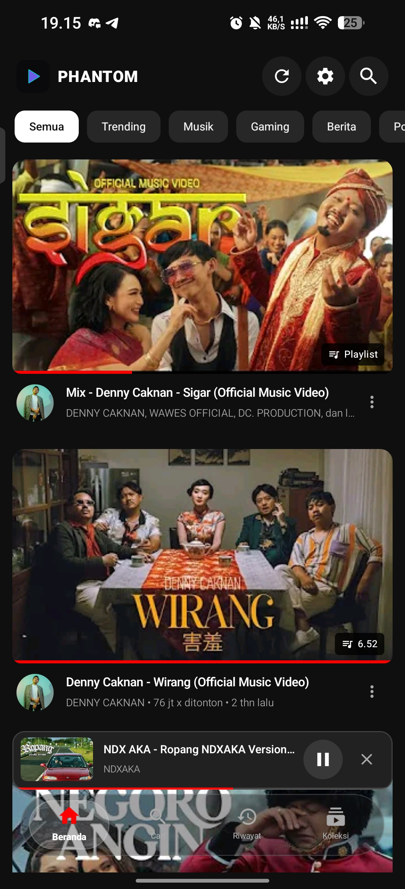
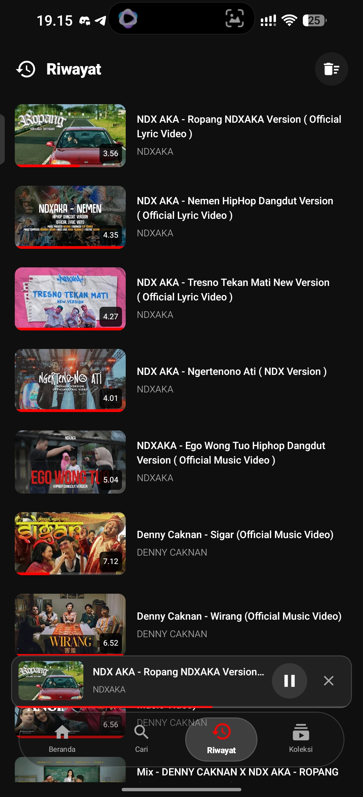
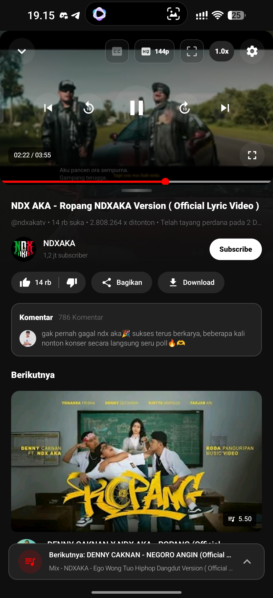
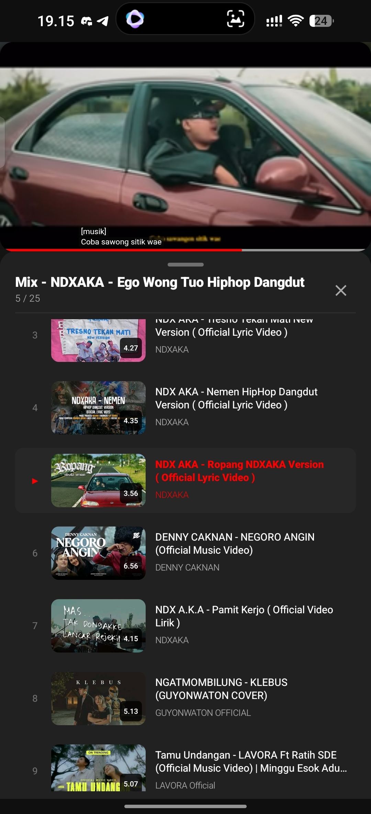
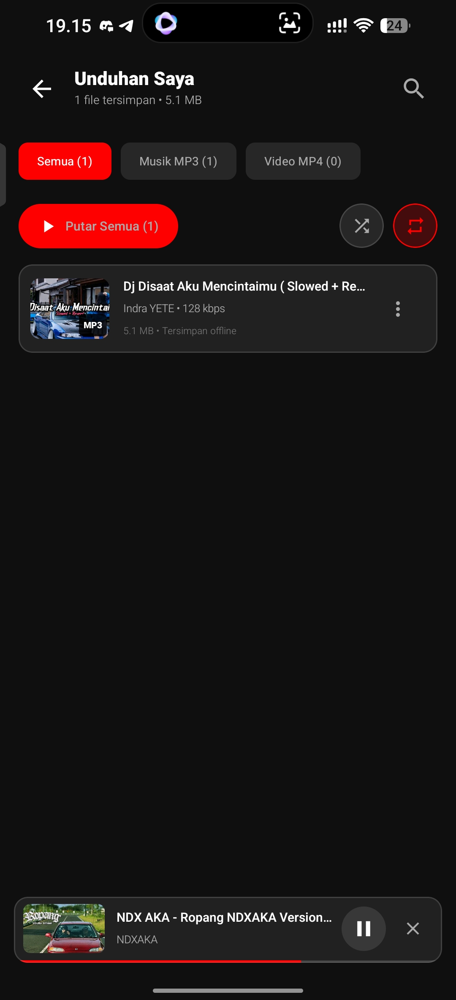
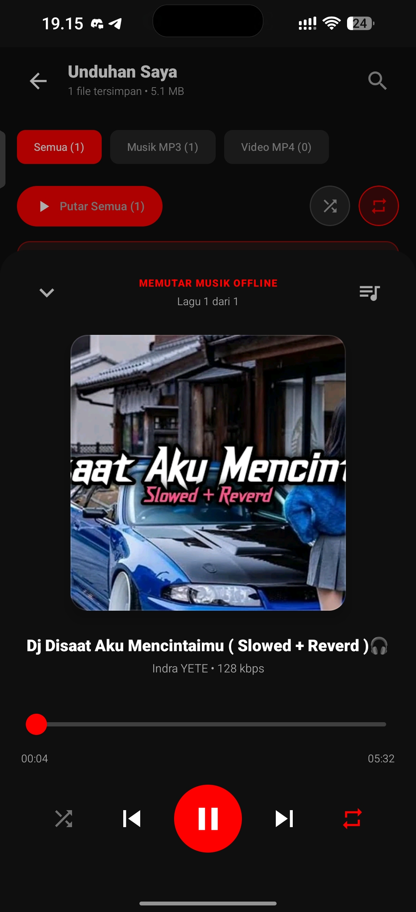
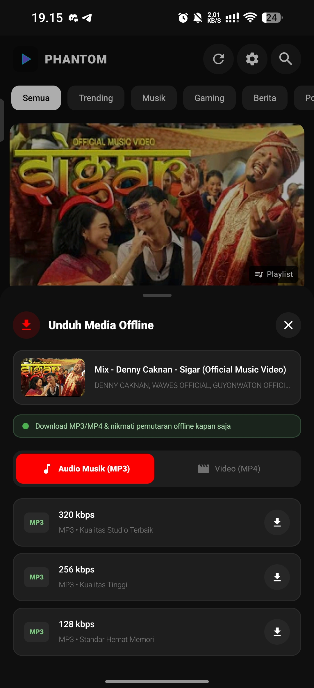
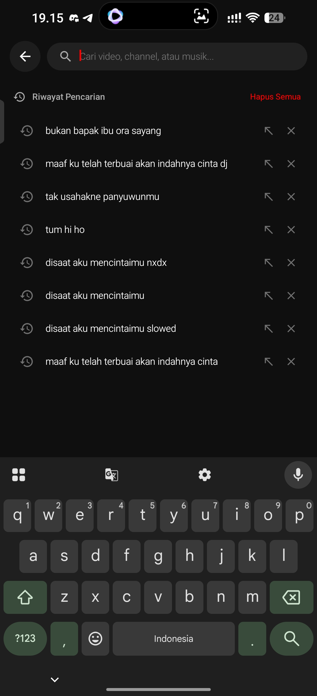
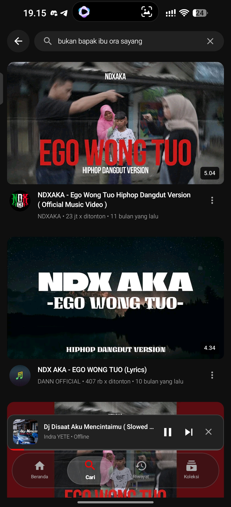

Phantom

A very lightweight alternative YouTube client for Android.

I initially wanted to keep this project private, but I have other things to work on. So, why not make it public? Maybe other developers will find it useful and continue developing it further.

## Preview

  
  
  

  
  
  

  
  
  

Features

Phantom is designed to provide a lightweight and stable YouTube client while keeping the application as small as possible.

Some of the existing features include:

- Video playback
- Mix / queue
- Video downloader
- Save videos to the device
- And more

You can check the commit history to see how the project has evolved and what has been implemented over time.

Lightweight

One of the main goals of Phantom is to keep the application lightweight without sacrificing stability and functionality.

The APK currently sits at around 1.6 MB, while still providing many of the features you would expect from a YouTube client.

Download

You can download the APK from APKPure:

"Download Phantom on APKPure" (https://apkpure.com/phantom/com.phantom.tube/download)

Development

This project was originally created as a personal hobby project.

I am making it public in the hope that other developers can learn from it, improve it, add new features, fix bugs, or continue the project in their own direction.

Contributions, improvements, and forks are welcome.

Disclaimer

This project was created as a hobby and for educational purposes.

It is not intended to compete with, harm, or take down YouTube or any related party.

YouTube and related trademarks belong to their respective owners.

License

This project is licensed under the MIT License.

See the "LICENSE" (LICENSE) file for the full license text.
